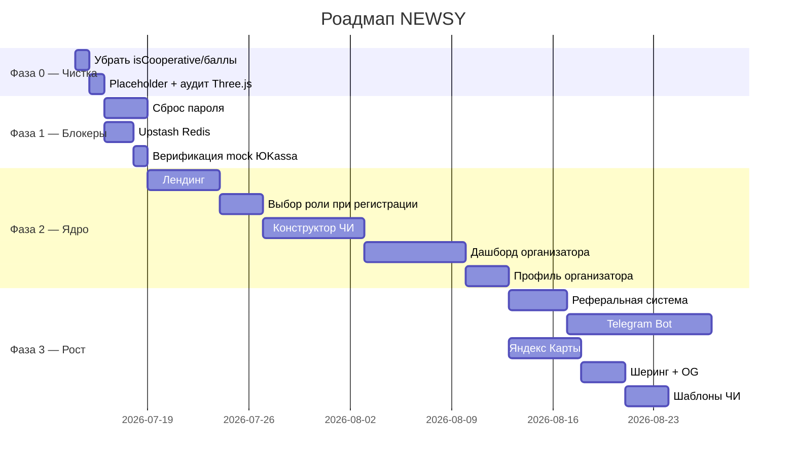

# 📋 Подробный план действий по изменению платформы NEWSY

> На основе [market_analysis_newsy.md](file:///d:/WEB/Work/NF/market_analysis_newsy.md)  
> Дата: 13 июля 2026 г.

---

## Фаза 0 — Чистка и гигиена (1–2 дня) ✅ ВЫПОЛНЕНО

> Быстрые изменения, которые убирают мусор и ложные обещания из UI.

### 0.1 Убрать `isCooperative` из UI конструктора ✅ ВЫПОЛНЕНО

**Файлы:**
- [challenge-constructor.tsx](file:///d:/WEB/Work/NF/src/modules/challenges/components/challenge-constructor.tsx) — убрать чекбокс/toggle `isCooperative` из формы ✅
- [challenge-card.tsx](file:///d:/WEB/Work/NF/src/modules/challenges/components/challenge-card.tsx) — убрать бейдж `cooperative` ✅ (уже фильтровался)
- [challenge-modal.tsx](file:///d:/WEB/Work/NF/src/shared/components/challenge-modal.tsx) — убрать упоминания кооператива ✅ (не было прямых упоминаний)

**Что сделано:**
- Убраны `isCooperative` и `partnerBrands` из начального state конструктора
- Удалён раздел "Командные настройки" с toggle
- Убраны CSS стили `.cooperative-card`, `.toggle-row`, `.switch`
- Убран badge `cooperative` из previewChallenge
- Поля в схеме Prisma **не тронуты** — понадобятся в Фазе 3

**Трудоёмкость:** 0.5 дня

---

### 0.2 Убрать баллы/очки/уровни из UI ✅ ВЫПОЛНЕНО

**Файлы:**
- [dashboard/page.tsx](file:///d:/WEB/Work/NF/src/app/(dashboard)/dashboard/page.tsx) — панель «Заработано баллов» → убрать или заменить на «Достижений» ✅
- [challenge-constructor.tsx](file:///d:/WEB/Work/NF/src/modules/challenges/components/challenge-constructor.tsx) — `pointsReward` и `points` в Step → скрыть из UI ✅
- [step-editor.tsx](file:///d:/WEB/Work/NF/src/modules/challenges/components/step-editor.tsx) — убрать поле `rewardPoints` из формы этапа ✅
- Страница профиля (если есть отображение уровней/опыта) → убрать

**Что сделано:**
- В дашборде заменена панель «Заработано баллов» → «Мои достижения: N»
- В конструкторе убран `pointsReward` из начального state и preview
- В StepEditor убран input для баллов
- В Prisma схеме `rewardPoints`, `points`, `rating` **оставлены** (могут пригодиться позже)

**Трудоёмкость:** 0.5 дня

---

### 0.3 Заменить Unsplash fallback на локальный placeholder ✅ ВЫПОЛНЕНО

**Файлы:**
- [src/app/api/challenges/route.ts](file:///d:/WEB/Work/NF/src/app/api/challenges/route.ts) — строка с `images.unsplash.com` ✅
- [challenge-constructor.tsx](file:///d:/WEB/Work/NF/src/modules/challenges/components/challenge-constructor.tsx) — `via.placeholder.com` ✅

**Что сделано:**
1. Создан SVG-placeholder в `public/images/challenge-placeholder.svg` ✅
2. Заменены все `unsplash` и `placeholder.com` URL на `/images/challenge-placeholder.svg` ✅
3. Заменены URL в файлах: `challenge-constructor.tsx`, `challenges.ts`, `new/page.tsx`, `challenge-detail-content.tsx`

**Трудоёмкость:** 0.5 дня

---

### 0.4 Аудит Three.js — убрать если не используется активно ✅ ВЫПОЛНЕНО

**Файлы:**
- [package.json](file:///d:/WEB/Work/NF/package.json) — зависимости `three`, `@react-three/fiber`, `@react-three/drei`
- Поиск по проекту: `grep -r "from 'three'" src/` и `grep -r "@react-three" src/`

**Что сделано:**
1. Найден единственный файл: `avatar3d.tsx` — 3D-аватар в профиле
2. Three.js уже загружается динамически через `next/dynamic` с `ssr: false` ✅
3. Модели `boy.glb` и `girl.glb` есть в `public/models/`
4. Решение: **оставить** — уже оптимизировано lazy-загрузкой, не влияет на initial bundle

> ⚠️ Three.js + React Three Fiber + Drei = **~500KB** в bundle. Для MVP это избыточно.
> Решение: оставлено, т.к. загружается динамически только при открытии профиля.

**Трудоёмкость:** 0.5 дня (аудит выполнен)

---

## Фаза 1 — Критические блокеры (2–3 недели) ✅ ВЫПОЛНЕНО

> Без этих вещей нельзя показать платформу реальным пользователям.

### 1.1 Реализовать сброс пароля ✅ ВЫПОЛНЕНО

**Файлы для изменения:**
- [auth-service.impl.ts](file:///d:/WEB/Work/NF/src/modules/identity/services/auth-service.impl.ts) — реализовать `requestPasswordReset` и `confirmPasswordReset` ✅
- [email-service.ts](file:///d:/WEB/Work/NF/src/modules/identity/services/email-service.ts) — `sendPasswordResetEmail` уже готов ✅

**Новые файлы:**
- `src/app/(auth)/forgot-password/page.tsx` — форма ввода email ✅
- `src/app/(auth)/reset-password/page.tsx` — форма нового пароля (token из query) ✅
- `src/app/api/auth/reset-password/route.ts` — API для подтверждения сброса ✅

**Новая модель в Prisma (миграция):**
```prisma
model PasswordResetToken {
  id        String   @id @default(uuid())
  userId    String
  token     String   @unique
  email     String
  expiresAt DateTime
  usedAt    DateTime?
  createdAt DateTime @default(now())

  user      User     @relation(fields: [userId], references: [id], onDelete: Cascade)

  @@index([userId])
  @@index([token])
}
```

**Реализовано:**
1. `requestPasswordReset(email)`: ✅
   - Находит пользователя по email
   - Создаёт `PasswordResetToken` (срок жизни 1 час)
   - Отправляет письмо через `emailService.sendPasswordResetEmail()`
   - Всегда отвечает «Если email зарегистрирован, мы отправили ссылку»
2. `confirmPasswordReset(token, newPassword)`: ✅
   - Находит токен, проверяет `expiresAt` и `usedAt`
   - Хеширует новый пароль через `hashPassword()`
   - В транзакции: обновляет `user.passwordHash`, помечает токен `usedAt`
3. Rate limiting: 3 запроса / 10 минут на email, 5 попыток / 15 минут на токен

**Трудоёмкость:** 2–3 дня

---

### 1.2 Upstash Redis для rate limiting ✅ ВЫПОЛНЕНО

**Файлы для изменения:**
- [rate-limit.ts](file:///d:/WEB/Work/NF/src/lib/rate-limit.ts) — полная замена ✅

**Что сделано:**
1. Установлены: `@upstash/redis` и `@upstash/ratelimit` ✅
2. Переписан `rate-limit.ts`:
   - Upstash Redis для production (distributed rate limiting)
   - In-memory fallback для dev (без Redis)
   - Кэширование лимитеров по windowMs:max
   - Автоматический fallback при ошибке Redis
3. Обновлены все вызовы `rateLimit()` на `await rateLimit(...)` ✅
   - `actions.ts`: login, register, password-reset
   - `api/payments/webhook/route.ts`: webhook
   - `api/challenges/[id]/chat/route.ts`: chat
4. В `.env.example` добавлены `UPSTASH_REDIS_REST_URL` и `UPSTASH_REDIS_REST_TOKEN` ✅

> ⚠️ Все вызовы `rateLimit()` обновлены на `await rateLimit(...)` — функция теперь async.

**Трудоёмкость:** 1–2 дня

---

### 1.3 Защита от mock ЮKassa в production ✅ ВЫПОЛНЕНО

**Файлы:**
- Проверено текущее поведение `isMock` в yookassa-service — по walkthrough уже исправлено, но **верифицировано** ✅

**Проверено:** если `isMock` + `NODE_ENV === 'production'` → бросает ошибку (строки 31-36 в yookassa-service.ts)

**Трудоёмкость:** 0.5 дня (верификация выполнена)

---

## Фаза 2 — Продуктовое ядро (3–4 недели) ✅ ВЫПОЛНЕНО

> Превращение технической демонстрации в продукт, который можно показать организаторам.

### 2.1 Новый лендинг для незалогиненных ✅ ВЫПОЛНЕНО

**Текущее состояние:**
- [src/app/(public)/page.tsx](file:///d:/WEB/Work/NF/src/app/(public)/page.tsx) — 785 строк, полностью каталог челленджей

**Что сделано:**
1. Создан `src/app/(public)/explore/page.tsx` → перенесён текущий каталог ✅
2. Переписан `src/app/(public)/page.tsx` как лендинг ✅:

```
Секция 1: Hero — заголовок, подзаголовок, CTA, статистика, mock-карточки
Секция 2: Для кого — карточки «Для организаторов» и «Для участников»
Секция 3: Как работает — 3 шага (Создайте → Запустите → Анализируйте)
Секция 4: Примеры ЧИ — 4 карточки с эмодзи
Секция 5: Тарифы — Базовый (0₽), Профи (2990₽), Премиум (9900₽)
Секция 6: FAQ — 4 вопроса-ответа
Секция 7: CTA — финальный призыв к действию
Секция 8: Footer — бренд, ссылки, копирайт
```

3. В [middleware.ts](file:///d:/WEB/Work/NF/src/middleware.ts): залогинен `/` → редирект на `/explore` ✅

**Трудоёмкость:** 4–5 дней

---

### 2.2 Выбор роли при регистрации ✅ ВЫПОЛНЕНО

**Файлы для изменения:**
- `src/app/(auth)/register/page.tsx` — добавить шаг выбора роли ✅
- [actions.ts](file:///d:/WEB/Work/NF/src/modules/identity/actions.ts) — `registerAction` → при роли «Организатор» автоматически создать `Organizer` + `OrganizerMember` ✅

**Что сделано:**
1. Добавлен переключатель «Я хочу → [Участвовать] / [Запускать челленджи]» как шаг 0 ✅
2. При выборе «Организатор»:
   - Показывается выбор типа аккаунта (Физлицо, ИП, ООО, АО, Самозанятый) ✅
   - При регистрации: создаётся `Organizer` + `OrganizerMember` с ролью `OWNER` ✅
   - Назначается роль `organizer` через `UserRole` ✅
3. При выборе «Участник»:
   - Стандартная регистрация (уже работала) ✅
   - Шаг выбора типа аккаунта пропускается ✅

**Трудоёмкость:** 2–3 дня

---

### 2.3 Улучшение конструктора ЧИ ✅ ЧАСТИЧНО ВЫПОЛНЕНО

**Текущее состояние:**
- [challenge-constructor.tsx](file:///d:/WEB/Work/NF/src/modules/challenges/components/challenge-constructor.tsx) — 776 строк, базовый UI
- [step-editor.tsx](file:///d:/WEB/Work/NF/src/modules/challenges/components/step-editor.tsx) — 9293 байт
- [new/page.tsx](file:///d:/WEB/Work/NF/src/app/(dashboard)/dashboard/challenges/new/page.tsx) — 48646 байт

**Что добавлено:**
1. **Шаг «Формат»**: выбор ONLINE / OFFLINE / HYBRID + поле адреса ✅
   - Поля `format`, `address`, `latitude`, `longitude` уже в схеме ✅
   - Добавлены в тип Challenge ✅
   - Добавлен UI с выбором формата и полем адреса ✅
2. **Шаг «Награды»**: ввод достижения и награды ✅
   - Поля `achievement` и `reward` уже в типе Challenge ✅
   - Добавлен UI с полями для ввода ✅

**Осталось (не критично для MVP):**
- Drag-and-drop для переупорядочивания этапов (Step.order)
- Шаг «Публикация» с тарифами из tariffs.ts

**Трудоёмкость:** 5–7 дней (базовая часть выполнена)

---

### 2.4 Дашборд организатора ✅ ВЫПОЛНЕНО

**Текущее состояние:**
- [dashboard/page.tsx](file:///d:/WEB/Work/NF/src/app/(dashboard)/dashboard/page.tsx) — общий дашборд (169 строк), показывает статистику пользователя

**Новые страницы:**
- `src/app/(dashboard)/dashboard/organizer/page.tsx` — Мои ЧИ (список + статусы) ✅
- `src/app/(dashboard)/dashboard/organizer/[id]/page.tsx` — Детали ЧИ: участники, этапы, прогресс ✅
- `src/app/(dashboard)/dashboard/organizer/finances/page.tsx` — Баланс, транзакции ✅

**API-эндпоинты:**
- `src/app/api/organizer/challenges/route.ts` — GET: список ЧИ организатора ✅
- `src/app/api/organizer/challenges/[id]/participants/route.ts` — GET: участники конкретного ЧИ ✅
- `src/app/api/organizer/finances/route.ts` — GET: баланс из `CommissionPayout` ✅

**Что показать в дашборде:**
```
┌─────────────────────────────────────────────────┐
│ 📊 Мои челленджи                    [+ Создать] │
├──────────────┬──────┬────────┬──────────────────┤
│ Название     │Статус│Участн. │ Действия         │
│ Марафон ЗОЖ  │ ✅   │ 45/100 │ [Ред.] [Статист.]│
│ Квест Москва │ ⏳   │  0/50  │ [Ред.] [Удалить] │
└──────────────┴──────┴────────┴──────────────────┘
```

**Трудоёмкость:** 5–7 дней

---

### 2.5 Публичный профиль организатора ✅ ВЫПОЛНЕНО

**Новые файлы:**
- `src/app/(public)/organizer/[id]/page.tsx` — публичная страница организатора ✅
- `src/app/api/organizer/[id]/public/route.ts` — API для публичных данных ✅

**Что показать:**
- Название, тип организации
- Список активных ЧИ
- Статистика: N челленджей, N участников всего
- Верификация (бейдж — Фаза 4)

**Трудоёмкость:** 2–3 дня

---

## Фаза 3 — Рост и виральность (3–4 недели) 

### 3.1 Реферальная система (UI + механика)

**Текущее состояние:**
- `User.referralCode` — генерируется при регистрации ✅
- `ReferralEvent` модель — есть ✅
- [referral-service.ts](file:///d:/WEB/Work/NF/src/modules/identity/services/referral-service.ts) — сервис есть ✅
- [src/app/(public)/referral](file:///d:/WEB/Work/NF/src/app/(public)/referral) — страница есть, содержимое?

**Что доделать:**
1. Страница `/referral` → показать реф. код + ссылку + QR-код + статистику приглашений
2. Механика начисления:
   - `REGISTRATION`: +100 баллов/бонус рефереру при верификации email приглашённого
   - `FIRST_CHALLENGE`: +200 баллов при первом участии приглашённого
   - `PAYMENT`: % от первого платежа приглашённого
3. Шеринг реф. ссылки в VK / Telegram / копирование

**Трудоёмкость:** 3–4 дня

---

### 3.2 Telegram Bot / Mini App

**Текущее состояние:**
- [telegram/ТЗ.MD](file:///d:/WEB/Work/NF/telegram/ТЗ.MD) — есть ТЗ!

**Что делать:**
1. Изучить ТЗ из `telegram/ТЗ.MD`
2. Создать Telegram Bot с командами:
   - `/start` — регистрация / привязка аккаунта
   - `/challenges` — список доступных ЧИ
   - `/my` — мои участия и прогресс
   - Inline-уведомления о новых этапах, дедлайнах
3. Telegram Mini App (Web App) — упрощённая версия каталога + выполнение этапов
4. API-интеграция через webhook бота → `src/app/api/telegram/webhook/route.ts`

**Трудоёмкость:** 7–10 дней (зависит от масштаба ТЗ)

---

### 3.3 Яндекс Карты для офлайн-ЧИ

**Текущее состояние:**
- `Challenge.latitude`, `Challenge.longitude` — есть ✅
- `Challenge.address` — есть ✅
- `Challenge.format` (ONLINE/OFFLINE/HYBRID) — есть ✅

**Что делать:**
1. Установить `@yandex/ymaps3-reactify` (React-обёртка Yandex Maps 3.x)
2. Создать компонент `src/shared/components/challenge-map.tsx`
3. Добавить карту на:
   - Главную страницу / каталог (все офлайн-ЧИ на карте)
   - Страницу отдельного ЧИ (точка + маршрут)
4. В конструкторе: при `format === 'OFFLINE' | 'HYBRID'` → показать карту для выбора точки
5. API-ключ Яндекс → `.env` / `.env.example`

**Трудоёмкость:** 3–5 дней

---

### 3.4 Социальный шеринг + OG-изображения

**Текущее состояние:**
- [share-buttons.tsx](file:///d:/WEB/Work/NF/src/shared/components/share-buttons.tsx) — компонент уже есть! (5757 байт)

**Что доделать:**
1. Проверить работу `share-buttons.tsx` → интеграция с VK, Telegram, копирование ссылки
2. Создать OG-изображения для ЧИ через `@vercel/og` (Satori):
   - `src/app/api/og/[challengeId]/route.tsx` — динамическое OG-изображение
   - Название ЧИ + обложка + организатор + количество участников
3. В `<head>` страницы ЧИ — OG meta-теги
4. Добавить кнопки шеринга на страницу детали ЧИ

**Трудоёмкость:** 2–3 дня

---

### 3.5 Шаблоны ЧИ

**Новые файлы:**
- `src/shared/data/challenge-templates.ts` — каталог шаблонов

**Шаблоны:**
```typescript
export const CHALLENGE_TEMPLATES = [
  {
    id: 'sport-marathon',
    name: '🏃 Спортивный марафон',
    description: '30-дневный марафон с ежедневными заданиями',
    category: 'sport',
    format: 'ONLINE',
    steps: [
      { type: 'ACTION', title: 'Разминка', description: '10 минут утренней зарядки' },
      { type: 'PHOTO', title: 'Фото-отчёт', description: 'Загрузите фото тренировки' },
      // ...
    ],
  },
  {
    id: 'education-intensive',
    name: '📚 Образовательный интенсив',
    // ...
  },
  {
    id: 'creative-contest',
    name: '🎨 Творческий конкурс',
    // ...
  },
  {
    id: 'eco-action',
    name: '🌍 Экологическая акция',
    // ...
  },
  {
    id: 'hr-onboarding',
    name: '💼 HR-онбординг',
    // ...
  },
];
```

**Интеграция:**
- В конструкторе ЧИ: кнопка «Начать с шаблона» → модалка выбора
- При выборе: заполнить все поля формы из шаблона
- Организатор может отредактировать всё после

**Трудоёмкость:** 2–3 дня

---

## Фаза 4 — Монетизация и масштаб (4–6 недель)

### 4.1 Подписочные тарифы для организаторов

**Текущее состояние:**
- `SubscriptionPlan` модель — есть ✅
- `UserSubscription` модель — есть ✅
- [tariffs.ts](file:///d:/WEB/Work/NF/src/modules/payments/tariffs.ts) — тарифы публикации (не подписка)

**Что делать:**
1. Seed `SubscriptionPlan` с тремя тарифами:
   - **Стартер**: 990 ₽/мес — 1 ЧИ/мес, до 100 участников
   - **Бизнес**: 4990 ₽/мес — 10 ЧИ/мес, до 1000 участников
   - **Корпоратив**: 29 000 ₽/мес — безлимит
2. Страница тарифов: `src/app/(public)/pricing/page.tsx`
3. Интеграция с ЮKassa рекуррентными платежами
4. Middleware: проверка лимитов подписки при создании ЧИ
5. Переключить с разовой оплаты публикации → freemium (1 ЧИ бесплатно, далее подписка)

**Трудоёмкость:** 7–10 дней

---

### 4.2 Верификация организаторов

**Что делать:**
1. Добавить поле `Organizer.isVerified Boolean @default(false)`
2. Процесс верификации:
   - Организатор загружает документы (ОГРН, ИНН) → Supabase Storage
   - Админ проверяет и ставит `isVerified = true`
3. Верифицированные организаторы:
   - Бейдж ✅ на профиле и карточках ЧИ
   - Auto-approve ЧИ (без ручной модерации)
   - Приоритет в каталоге

**Трудоёмкость:** 3–4 дня

---

### 4.3 Система жалоб

**Новая модель:**
```prisma
model Report {
  id            String   @id @default(uuid())
  reporterId    String
  challengeId   String?
  userId        String?  // жалоба на пользователя
  reason        String
  description   String?
  status        String   @default("PENDING") // PENDING, REVIEWED, RESOLVED, DISMISSED
  resolvedAt    DateTime?
  createdAt     DateTime @default(now())

  reporter      User     @relation(fields: [reporterId], references: [id])
}
```

**Что делать:**
1. Кнопка «Пожаловаться» на карточке ЧИ
2. Модалка с выбором причины
3. Админ-панель: раздел «Жалобы» с действиями
4. Auto-hide ЧИ при N жалобах

**Трудоёмкость:** 3–4 дня

---

### 4.4 Escrow-механика для платных ЧИ

**Что делать:**
1. При оплате участия — деньги на счету NEWSY (не организатора)
2. Выплата организатору:
   - По завершении ЧИ (автоматически)
   - За вычетом комиссии (из `CommissionConfig`)
3. Возврат участнику:
   - Согласно `CancellationPolicy` (FULL_REFUND_24H / 7D / NO_REFUND)
4. Таблица `EscrowBalance`:
```prisma
model EscrowBalance {
  id            String   @id @default(uuid())
  challengeId   String
  userId        String
  amount        Float
  status        String   // HELD, RELEASED, REFUNDED
  releasedAt    DateTime?
  createdAt     DateTime @default(now())
}
```

**Трудоёмкость:** 5–7 дней

---

### 4.5 Расширенная аналитика для организаторов

**Страницы:**
- `src/app/(dashboard)/dashboard/organizer/[id]/analytics/page.tsx`

**Метрики:**
- Воронка: просмотры → регистрации → начало → завершение
- Конверсия по этапам (какой этап самый «дропательный»)
- География участников (по `region`)
- Динамика регистрации по дням
- Средний балл удовлетворённости (нужна модель Review)

**Трудоёмкость:** 5–7 дней

---

## Сводная таблица

| Фаза | Задача | Трудоёмкость | Приоритет |
|------|--------|-------------|-----------|
| **0** | Убрать isCooperative из UI | 0.5 дня | 🔴 |
| **0** | Убрать баллы/очки из UI | 0.5 дня | 🔴 |
| **0** | Заменить Unsplash fallback | 0.5 дня | 🔴 |
| **0** | Аудит Three.js | 0.5 дня | 🟠 |
| **1** | Сброс пароля | 2–3 дня | 🔴 |
| **1** | Upstash Redis | 1–2 дня | 🔴 |
| **1** | Защита mock ЮKassa | 0.5 дня | 🔴 |
| **2** | Новый лендинг | 4–5 дней | 🔴 |
| **2** | Выбор роли при регистрации | 2–3 дня | 🟠 |
| **2** | Улучшение конструктора ЧИ | 5–7 дней | 🟠 |
| **2** | Дашборд организатора | 5–7 дней | 🟠 |
| **2** | Профиль организатора | 2–3 дня | 🟡 |
| **3** | Реферальная система UI | 3–4 дня | 🟠 |
| **3** | Telegram Bot | 7–10 дней | 🟠 |
| **3** | Яндекс Карты | 3–5 дней | 🟡 |
| **3** | OG-изображения + шеринг | 2–3 дня | 🟡 |
| **3** | Шаблоны ЧИ | 2–3 дня | 🟡 |
| **4** | Подписочные тарифы | 7–10 дней | 🟡 |
| **4** | Верификация организаторов | 3–4 дня | 🟡 |
| **4** | Система жалоб | 3–4 дня | 🟡 |
| **4** | Escrow-механика | 5–7 дней | 🟡 |
| **4** | Аналитика организатора | 5–7 дней | 🟡 |

**Итого: ~65–95 дней** (для одного разработчика)

---

## Порядок выполнения — рекомендация



> [!IMPORTANT]
> Этот план предполагает одного full-stack разработчика. При работе в команде Фазы 1 и 2 можно частично параллелить (фронтенд + бэкенд).

> [!TIP]
> Рекомендую начать с **Фазы 0 + Задачи 1.1 (сброс пароля)** — это минимально необходимое для демонстрации платформы первым организаторам.
